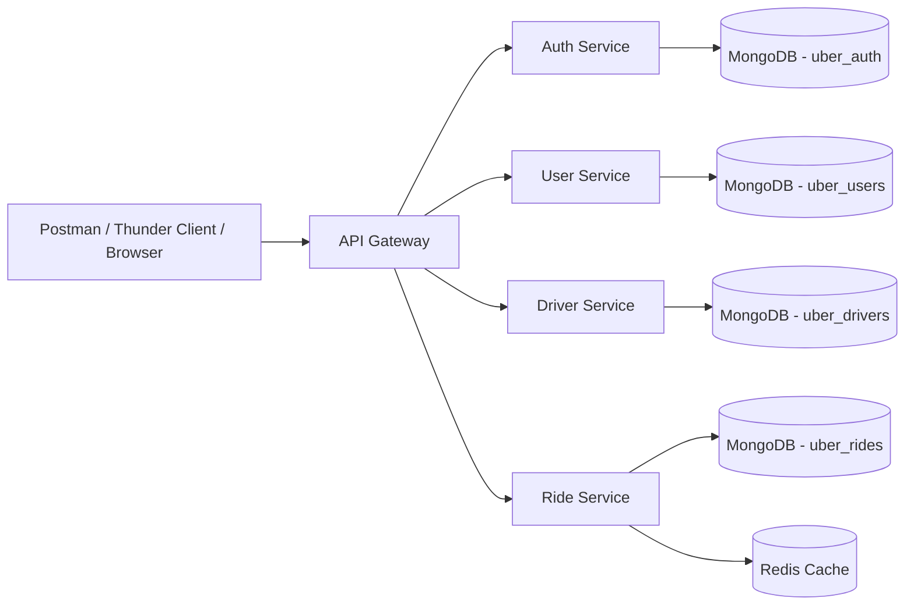

# Uber-Like Backend Clone

This project is a learning-focused, beginner-friendly Uber-like ride-booking backend built with Node.js, Express, MongoDB, Redis, and JWT.

It is designed to help you understand:
- REST API design
- Microservice structure
- CRUD operations
- Authentication and authorization
- Service-to-service communication
- MongoDB and Redis basics
- JWT flow
- Middleware, validation, and error handling
- Postman testing

This is a simplified backend for learning, not production-grade Uber infrastructure.

---

## 1. Project Overview

The system has 5 main services in the current implementation:
- API Gateway
- Auth Service
- User Service
- Driver Service
- Ride Service

Clients communicate only with the API Gateway. The gateway routes requests to the correct service over HTTP.

The goal is to model a simplified ride-booking flow:
- Rider registers and logs in
- Driver registers and sets online/available status
- Rider creates a ride
- Driver accepts the ride
- Driver starts and completes the ride
- Ride history is visible to rider and driver

---

## 2. Architecture

### High-level architecture



### Why this architecture

WHAT:
- We split responsibilities into small services.

WHY:
- It is easier to understand than a single monolith.
- Each service owns its own data and logic.
- It prepares you for real-world backend architecture patterns.

WHERE:
- API Gateway is the public entry point.
- Auth handles tokens and login.
- User manages user profile data.
- Driver handles driver profiles and availability.
- Ride handles ride creation, transitions, and fare logic.

HOW:
- Services talk to each other over HTTP REST APIs.
- The API Gateway forwards client requests to the backed service.

---

## 3. Microservices Responsibilities

### API Gateway
Responsible for:
- receiving all client requests
- routing requests to the correct service
- hiding internal service URLs from the client

Base URL:
- http://localhost:3000

Routes:
- /api/auth/*
- /api/users/*
- /api/drivers/*
- /api/rides/*

---

### Auth Service
Responsible for:
- user registration
- login
- refresh token flow
- logout
- fetching current user
- JWT authentication and authorization

Port:
- 4001

Main endpoints:
- POST /api/auth/register
- POST /api/auth/login
- POST /api/auth/refresh
- POST /api/auth/logout
- GET /api/auth/me

---

### User Service
Responsible for:
- user profile CRUD
- listing users for admin
- blocking and unblocking users

Port:
- 4002

Main endpoints:
- GET /api/users/me
- GET /api/users/:id
- PUT /api/users/:id
- DELETE /api/users/:id
- GET /api/users
- PATCH /api/users/:id/block
- PATCH /api/users/:id/unblock

---

### Driver Service
Responsible for:
- driver profile creation
- driver profile update
- online/offline status
- availability updates
- fetching available drivers

Port:
- 4003

Main endpoints:
- POST /api/drivers
- GET /api/drivers/:id
- PUT /api/drivers/:id
- DELETE /api/drivers/:id
- PATCH /api/drivers/:id/online
- PATCH /api/drivers/:id/offline
- PATCH /api/drivers/:id/availability
- GET /api/drivers/available

---

### Ride Service
Responsible for:
- creating rides
- assigning an available driver
- ride status transitions
- valid ride lifecycle checks
- fare calculation
- ride history queries

Port:
- 4004

Main endpoints:
- POST /api/rides
- GET /api/rides/:id
- GET /api/rides/user/:userId
- GET /api/rides/driver/:driverId
- PATCH /api/rides/:id/accept
- PATCH /api/rides/:id/start
- PATCH /api/rides/:id/complete
- PATCH /api/rides/:id/cancel

---

## 4. Request Flow

### Example: Rider registers and logs in

```text
Postman
  -> API Gateway /api/auth/register
  -> Auth Service
  -> MongoDB (uber_auth)
  -> User Service creates profile
  -> JWT access token + refresh token returned
```

### Example: Rider requests ride

```text
Client
  -> API Gateway /api/rides
  -> Ride Service
  -> Ride Service calls Driver Service /api/drivers/available
  -> chooses first available driver
  -> ride is created with status = requested
```

### Example: Driver accepts ride

```text
Driver
  -> API Gateway /api/rides/:id/accept
  -> Ride Service validates transition
  -> ride status changes to accepted
```

---

## 5. Database Design

Each service owns its own MongoDB database.

Database names used in this project:
- uber_auth
- uber_users
- uber_drivers
- uber_rides

### Why separate databases

WHAT:
- Each microservice has its own data store.

WHY:
- Reduces coupling between services
- Easier to scale and maintain independently
- Simpler for a learning project

HOW:
- Services use Mongoose models and connect to their own Mongo database.
- They do not share the same Mongoose model instance directly.

---

## 6. Redis Usage

Redis is used minimally for temporary data.

Current use cases:
- ride lookup cache
- ride:<id> temporary key
- TTL around 300 seconds

Important idea:
- MongoDB = permanent data
- Redis = temporary/cache data

This project keeps Redis simple and avoids caching everything.

---

## 7. Authentication Flow

### JWT basics

The Auth service creates:
- access token
- refresh token

Example payload:

```json
{
  "userId": "64abc...",
  "role": "rider",
  "email": "rider@test.com"
}
```

### Middleware used
- requireAuth
- requireRole("driver")
- requireRole("admin")

### Why JWT

WHAT:
- JWT is a stateless token used for identity verification.

WHY:
- It is simple and works well in a learning backend.
- Good for understanding token-based authentication.

WHERE:
- In the Auth Service for token generation and verification.
- In other services for protected route checks.

---

## 8. Ride Lifecycle

Ride status transitions are intentionally simple.

```text
requested
  -> accepted
  -> driver_arriving
  -> in_progress
  -> completed
```

Also supported:
- requested -> cancelled
- accepted -> cancelled
- driver_arriving -> cancelled
- in_progress -> cancelled

Invalid transitions are blocked, such as:
- completed -> accepted
- cancelled -> started
- completed -> cancelled

---

## 9. Fare Calculation

Fare logic is kept simple in:
- ride-service/src/services/fare.service.js

Formula used:

```text
baseFare = 50
pricePerKm = 15
pricePerMinute = 2

fare = baseFare + (distance * pricePerKm) + (duration * pricePerMinute)
```

This is intentionally easy to modify later.

---

## 10. Folder Structure

```text
UBER_BACKEND/
├── api-gateway/
│   ├── src/
│   ├── .env
│   ├── .env.example
│   └── package.json
├── auth-service/
│   ├── src/
│   ├── .env
│   ├── .env.example
│   └── package.json
├── user-service/
│   ├── src/
│   ├── .env
│   ├── .env.example
│   └── package.json
├── driver-service/
│   ├── src/
│   ├── .env
│   ├── .env.example
│   └── package.json
├── ride-service/
│   ├── src/
│   ├── .env
│   ├── .env.example
│   └── package.json
├── shared/
│   ├── apiError.js
│   └── response.js
├── docker-compose.yml
├── .gitignore
├── README.md
└── package-lock.json
```

---

## 11. Technologies Used

Main stack:
- Node.js
- Express.js
- JavaScript
- MongoDB
- Mongoose
- Redis
- JWT
- bcryptjs
- axios
- dotenv
- Joi
- Postman / Thunder Client

Not used here:
- GraphQL
- Kafka
- Docker for core runtime development
- advanced distributed systems patterns

---

## 12. Prerequisites

Before running this project, make sure you have:
- Node.js installed
- npm installed
- MongoDB Atlas or local MongoDB instance
- Redis installed locally or use a cache-disabled mode for local learning

Recommended:
- Node.js 18 or newer
- Postman or Thunder Client

---

## 13. Environment Variables

Each service has its own `.env` file.

Example inside `api-gateway/.env`:

```env
PORT=3000
AUTH_SERVICE_URL=http://localhost:4001
USER_SERVICE_URL=http://localhost:4002
DRIVER_SERVICE_URL=http://localhost:4003
RIDE_SERVICE_URL=http://localhost:4004
```

Example inside `auth-service/.env`:

```env
PORT=4001
MONGO_URI=mongodb+srv://<username>:<password>@cluster.mongodb.net/uber_auth?retryWrites=true&w=majority
JWT_SECRET=dev_secret
JWT_ACCESS_EXPIRES_IN=15m
JWT_REFRESH_EXPIRES_IN=7d
USER_SERVICE_URL=http://localhost:4002
```

Example inside `ride-service/.env`:

```env
PORT=4004
MONGO_URI=mongodb+srv://<username>:<password>@cluster.mongodb.net/uber_rides?retryWrites=true&w=majority
REDIS_URL=redis://localhost:6379
JWT_SECRET=dev_secret
DRIVER_SERVICE_URL=http://localhost:4003
```

Important:
- Never hardcode secrets in source code
- Keep `.env` local and private

---

## 14. Installing Dependencies

From the root of each service folder, run:

```bash
cd api-gateway
npm install

cd ../auth-service
npm install

cd ../user-service
npm install

cd ../driver-service
npm install

cd ../ride-service
npm install
```

---

## 15. Running the Project with nodemon

Each service contains a `dev` script:

```bash
npm run dev
```

Run all services in separate terminals:

### Terminal 1 - API Gateway
```bash
cd C:\Users\Piyus\OneDrive\Documents\UBER_BACKEND\api-gateway
npm run dev
```

### Terminal 2 - Auth Service
```bash
cd C:\Users\Piyus\OneDrive\Documents\UBER_BACKEND\auth-service
npm run dev
```

### Terminal 3 - User Service
```bash
cd C:\Users\Piyus\OneDrive\Documents\UBER_BACKEND\user-service
npm run dev
```

### Terminal 4 - Driver Service
```bash
cd C:\Users\Piyus\OneDrive\Documents\UBER_BACKEND\driver-service
npm run dev
```

### Terminal 5 - Ride Service
```bash
cd C:\Users\Piyus\OneDrive\Documents\UBER_BACKEND\ride-service
npm run dev
```

### One PowerShell command to open all in separate terminals

```powershell
Start-Process powershell -ArgumentList '-NoExit','-Command','cd C:\Users\Piyus\OneDrive\Documents\UBER_BACKEND\api-gateway; npm run dev'
Start-Process powershell -ArgumentList '-NoExit','-Command','cd C:\Users\Piyus\OneDrive\Documents\UBER_BACKEND\auth-service; npm run dev'
Start-Process powershell -ArgumentList '-NoExit','-Command','cd C:\Users\Piyus\OneDrive\Documents\UBER_BACKEND\user-service; npm run dev'
Start-Process powershell -ArgumentList '-NoExit','-Command','cd C:\Users\Piyus\OneDrive\Documents\UBER_BACKEND\driver-service; npm run dev'
Start-Process powershell -ArgumentList '-NoExit','-Command','cd C:\Users\Piyus\OneDrive\Documents\UBER_BACKEND\ride-service; npm run dev'
```

---

## 16. Health Check URLs

Once the services are running, verify:

- Gateway: http://localhost:3000/health
- Auth: http://localhost:4001/health
- User: http://localhost:4002/health
- Driver: http://localhost:4003/health
- Ride: http://localhost:4004/health

---

## 17. Postman / Thunder Client Flow

Use the API Gateway as the main base URL.

### Step 1 - Register rider

POST http://localhost:3000/api/auth/register

```json
{
  "name": "Rider One",
  "email": "rider@test.com",
  "password": "123456",
  "phone": "9876543210",
  "role": "rider"
}
```

### Step 2 - Login rider

POST http://localhost:3000/api/auth/login

```json
{
  "email": "rider@test.com",
  "password": "123456"
}
```

Copy the access token and add it to Authorization header:

```text
Authorization: Bearer <access_token>
```

### Step 3 - Register driver

POST http://localhost:3000/api/auth/register

```json
{
  "name": "Driver One",
  "email": "driver@test.com",
  "password": "123456",
  "phone": "9123456780",
  "role": "driver"
}
```

### Step 4 - Create driver profile

POST http://localhost:3000/api/drivers

```json
{
  "userId": "<driver_user_id_from_auth_or_user_profile>",
  "name": "Driver One",
  "phone": "9123456780",
  "licenseNumber": "DL12345",
  "vehicle": {
    "type": "car",
    "model": "Swift",
    "plateNumber": "UK12AB1234",
    "color": "white"
  }
}
```

### Step 5 - Driver goes online

PATCH http://localhost:3000/api/drivers/:id/online

### Step 6 - Rider requests ride

POST http://localhost:3000/api/rides

```json
{
  "riderId": "<rider_user_id>",
  "pickup": {
    "address": "Bandra West",
    "latitude": 19.0596,
    "longitude": 72.8295
  },
  "destination": {
    "address": "Andheri East",
    "latitude": 19.1136,
    "longitude": 72.8697
  },
  "distanceKm": 8,
  "durationMinutes": 20
}
```

### Step 7 - Driver accepts ride

PATCH http://localhost:3000/api/rides/:id/accept

### Step 8 - Driver starts ride

PATCH http://localhost:3000/api/rides/:id/start

### Step 9 - Driver completes ride

PATCH http://localhost:3000/api/rides/:id/complete

### Step 10 - Get ride details

GET http://localhost:3000/api/rides/:id

### Step 11 - View ride history

GET http://localhost:3000/api/rides/user/:userId

---

## 18. Common Response Format

Success response:

```json
{
  "success": true,
  "message": "Ride created successfully",
  "data": {}
}
```

Error response:

```json
{
  "success": false,
  "message": "Ride not found"
}
```

---

## 19. Security Basics Included

This project includes basic security practices:
- password hashing with bcryptjs
- JWT auth
- role-based authorization
- helmet
- cors
- rate limiting on auth routes
- environment variables for secrets

---

## 20. Learning Notes

This project teaches the following concepts clearly:

### Controllers
- receive HTTP requests
- call services
- respond with structured JSON

### Services
- contain business logic
- separate logic from route layer

### Models
- define MongoDB schema with Mongoose

### Middleware
- authentication
- authorization
- validation
- error handling

### REST communication
- API Gateway forwards to services
- services are independent apps

---

## 21. Future Improvements

These are recommended next steps after this learning project:
- Payment service with real payment gateway integration
- Admin service with dashboard data
- Redis for more caching and session data
- better validation and sanitization
- real GPS and driver matching
- request queue / retry logic
- more robust monitoring and logs

---

## 22. Troubleshooting

### MongoDB connection issues
- confirm your MongoDB URI is valid
- whitelist your IP in MongoDB Atlas
- verify database name is correct

### Redis issues
- Redis is optional for local learning in this project
- if Redis is not running, the app still starts and continues without cache

### Gateway not routing correctly
- confirm all service ports are correct
- check that each service is running
- verify `.env` values in each service

---

## 23. Summary

This project is a simple, readable backend for learning microservice patterns, REST APIs, JWT auth, MongoDB usage, Redis basics, and ride-booking workflows.

It keeps the architecture understandable while still showing realistic backend responsibilities.

If you are learning backend engineering, this is a strong project to practice and explain in interviews.
